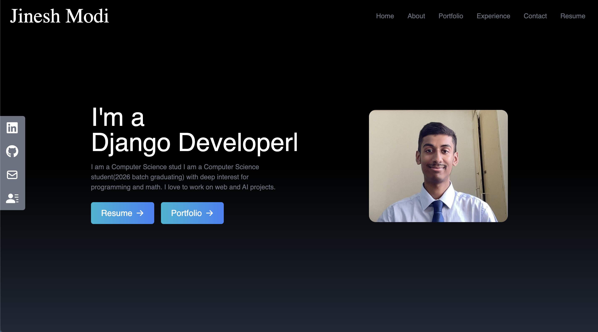
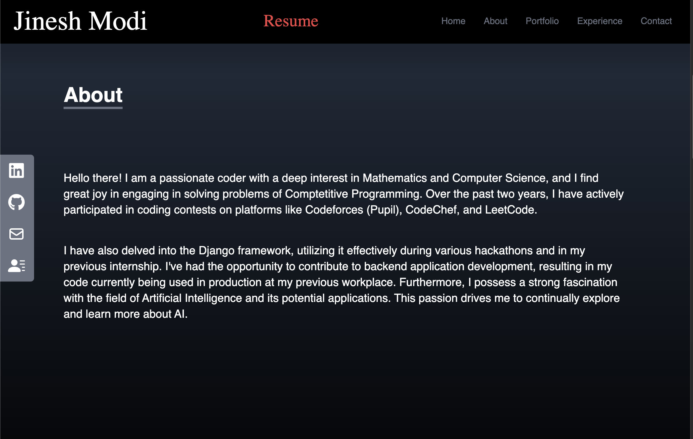
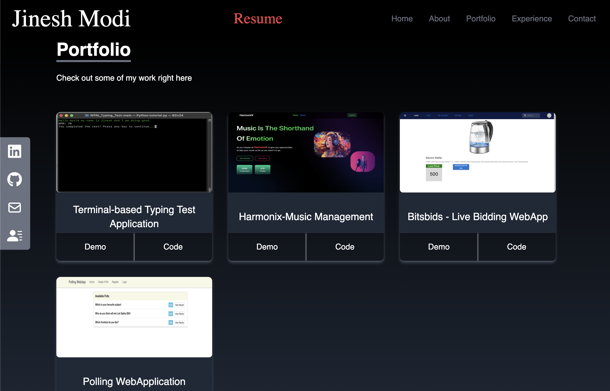
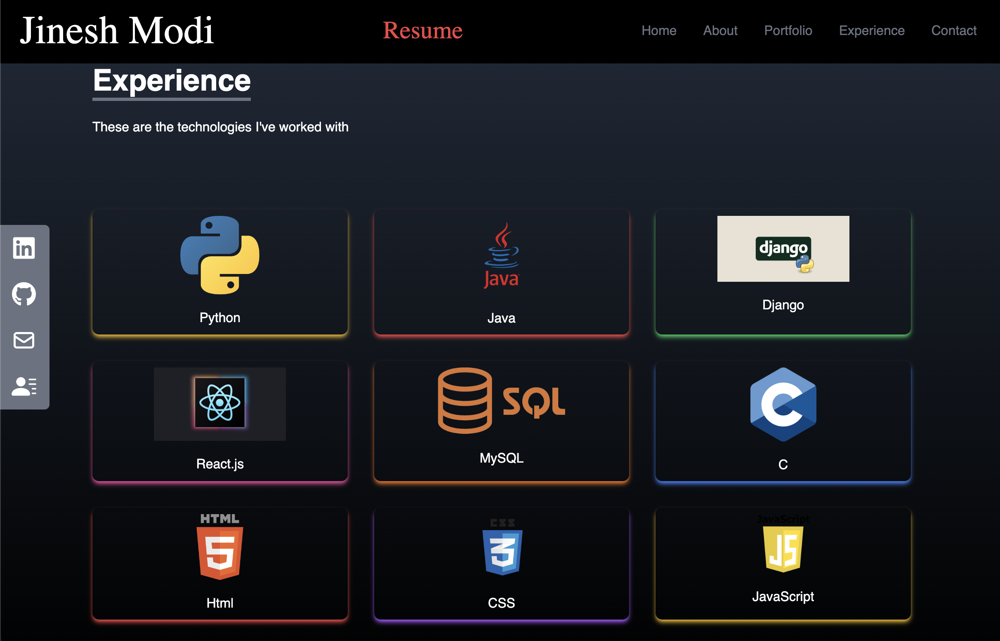
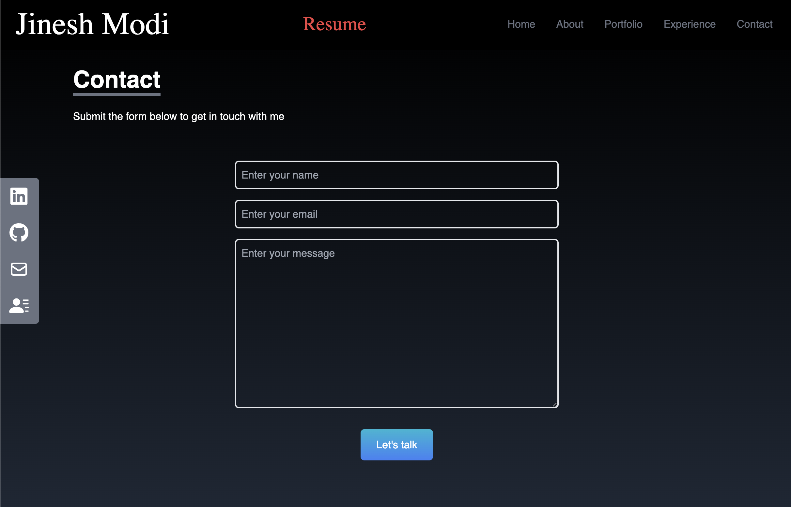

# Personal Portfolio Website

This is a personal portfolio website to showcase my work, skills, and experience as a Computer Science student, competitive programmer, and developer. Built with modern web technologies, it includes sections for my projects, experience, and ways to get in touch with me.

## Website Overview
### HomePage

### AboutPage

### Projects

### Technologies

### ContactMe

### Experience
Technologies I have worked with:
- **Languages**: Python, Java, C, HTML, CSS, JavaScript
- **Frameworks**: Django, React.js
- **Databases**: MySQL

### Contact
Feel free to reach out to me via the contact form or through my social links:
- LinkedIn
- GitHub